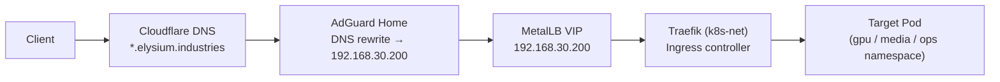
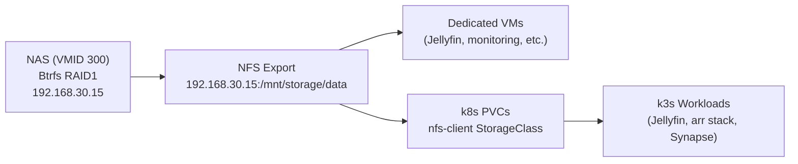

# Architecture

## Overview

Jellybuntu is a hybrid Proxmox homelab running on an AMD EPYC 7313P single-node host. Dedicated VMs handle
stateful or hardware-specific services (NAS, Home Assistant, game servers), while a 5-node k3s cluster managed
by Flux GitOps runs the media automation and ops workloads. Four VLANs segment traffic by function: management,
IoT, media, and games.

## System Diagram

```mermaid
graph TD
    HOST["Proxmox Host\nAMD EPYC 7313P"]

    HOST --> DEDICATED["Dedicated VMs"]
    HOST --> K3S["k3s Cluster"]

    DEDICATED --> NAS["nas (300)\n192.168.30.15\nBtrfs RAID1 + NFS"]
    DEDICATED --> HA["home-assistant (100)\n192.168.20.10\nSmart home hub"]
    DEDICATED --> SAT["satisfactory-server (200)\n192.168.40.11\nGame server"]
    DEDICATED --> MON["monitoring (500)\n192.168.10.16\nPrometheus + Grafana"]
    DEDICATED --> WP["woodpecker-ci (600)\n192.168.10.17\nCI/CD"]
    DEDICATED --> LC["lancache (700)\n192.168.40.18\nGame download cache"]
    DEDICATED --> UNI["unifi-controller (800)\n192.168.10.19\nNetwork mgmt"]
    DEDICATED --> RP["reverse-proxy (900)\n192.168.10.20\nTraefik + Tailscale TLS"]

    K3S --> CTL["k8s-control (410)\n192.168.30.40\nControl plane"]
    K3S --> GPU["k8s-gpu (411)\n192.168.30.41\nJellyfin + Tdarr"]
    K3S --> MED["k8s-media (412)\n192.168.30.42\narr stack + download clients"]
    K3S --> NET["k8s-net (413)\n192.168.30.43\nMetalLB + Traefik ingress"]
    K3S --> OPS["k8s-ops (414)\n192.168.30.44\nSynapse + monitoring + CI"]
```

## k3s Cluster Topology

| Node | VMID | IP | Role | Services |
|------|------|----|------|----------|
| k8s-control | 410 | 192.168.30.40 | Control plane | k3s API server, etcd, scheduler |
| k8s-gpu | 411 | 192.168.30.41 | Worker — GPU | Jellyfin, Tdarr (GTX 1080 passthrough) |
| k8s-media | 412 | 192.168.30.42 | Worker — media | Sonarr, Radarr, Lidarr, Prowlarr, Bazarr, Jellyseerr, Navidrome, qBittorrent, SABnzbd, Byparr |
| k8s-net | 413 | 192.168.30.43 | Worker — network | MetalLB speaker, Traefik ingress controller |
| k8s-ops | 414 | 192.168.30.44 | Worker — ops | Synapse, Coturn, LiveKit, PostgreSQL, Woodpecker CI |

MetalLB IP pool: `192.168.30.200/29` (L2 mode). Traefik VIP: `192.168.30.200`.

## Dedicated VMs

| VM | VMID | IP | Purpose | Why Not k3s |
|----|------|----|---------|-------------|
| nas | 300 | 192.168.30.15 | Btrfs RAID1 storage, NFS server | Physical disk passthrough; must start first |
| home-assistant | 100 | 192.168.20.10 | Smart home automation | Needs USB/Zigbee passthrough; IoT VLAN isolation |
| satisfactory-server | 200 | 192.168.40.11 | Satisfactory dedicated server | CPU pinning (cores 4-7); games VLAN |
| monitoring | 500 | 192.168.10.16 | Prometheus, Alertmanager, Grafana | Predates k3s; standalone stack |
| woodpecker-ci | 600 | 192.168.10.17 | Woodpecker CI server | Builds Proxmox infrastructure; needs host access |
| lancache | 700 | 192.168.40.18 | Game download cache (Steam, Epic) | Games VLAN placement; large NFS cache volume |
| unifi-controller | 800 | 192.168.10.19 | UniFi network management | Management VLAN; MongoDB + Java stack |
| reverse-proxy | 900 | 192.168.10.20 | Traefik v3, Tailscale TLS termination | Routes Tailscale traffic to VM services |
| db | 415 | 192.168.30.16 | Centralized PostgreSQL | Persistent DB for k3s services (external to cluster) |

## Ingress Flow

Tailscale-only services (VM-hosted) route through `reverse-proxy` (VMID 900) using
`*.discus-moth.ts.net` certificates.

## Data Flow

NFS subdir provisioner dynamically creates per-PVC subdirectories. All media and config data
lives on the NAS — nodes are stateless and replaceable.

## Network VLANs

| VLAN | ID | Subnet | Purpose |
|------|----|--------|---------|
| management | 10 | 192.168.10.0/24 | Infrastructure VMs (monitoring, CI, proxy) |
| iot | 20 | 192.168.20.0/24 | Home Assistant, IoT devices |
| media | 30 | 192.168.30.0/24 | NAS, k3s cluster, Jellyfin |
| games | 40 | 192.168.40.0/24 | Satisfactory, Lancache |

## Cross-Repository Relationship

[`jellybuntu`](https://github.com/SilverDFlame/jellybuntu) provisions all Proxmox VMs via
Terraform and configures them via Ansible roles. Once the k3s nodes are up,
[`jellybuntu-helm`](https://github.com/SilverDFlame/jellybuntu-helm) takes over: Flux CD
watches the repo's `main` branch and reconciles all workloads automatically. This wiki
documents both layers and serves as the operational reference.
